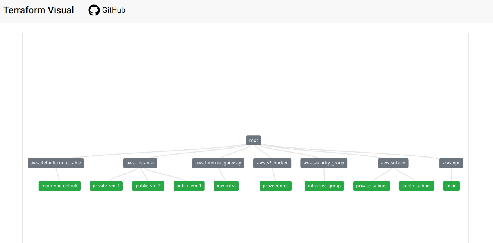

# Diagrama de la infraestructura:
## [Referencia](https://github.com/hieven/terraform-visual)

###### Ejecutar el diagrama:

Este plano es generado con la infraestructura **actual**, para activarla seguiremos lo siguiente:
Dentro de la carpeta: `terraform-visual-report` buscamos el index y ejecutamos.

###### Crear el diagrama desde 0

1. En la carpeta raiz, comprobamos nuestra infraestructura: `terraform fmt ; terraform validate`

2. Creacion del plan: `terraform plan -out=plan.out`

3. Convertir a json: `terraform show -json plan.out > plan.json`

4. Crear el diagrama: `terraform-visual --plan plan.json`

